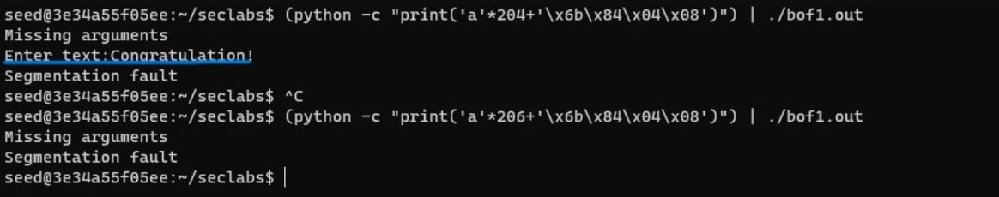

# 21110756_Nguyễn Đình Minh Chiến
# Lab 1: Buffer Over Flow#
# Task 1 Stack smashing by memory overwritten
## 1.1. bof1.c
To make a buffer overflow attack in bof1.c program, we see the program has array with size of 200 inside vuln function, we can visualize as model below:

Build the program using gcc -g bof1.c -o bof1.o and -fno-stack-protection to disable stack protection and set boundary = 2:

Go to gdp of 'bof1.out' with the command `gdb bof1.out -q`, and find the address of the **'selectFunc'** function with the command `disas secretFunc`. So we can get the address of function **'selectFunc'** as follows '0x0804846b'
 
Run the program with the 204 letter 'a' plus the address of the **'selectFunc'** function with the following command `(python -c "print('a'*204+'\x6b\x84\x04\x08')") | ./bof1.out`
 

->>***The terminal showing the 'Congratulation!' line from the 'secretFunc' function which means this method worked***

## 1.2. bof2.c
In this program, we need to make buffer overflow to spill the data into ‘check’ variable to make it equals to `0xdeadbeef` to satisfy the condition.
First, we visualize the Stack frame:

Build the program using gcc -g bof2.c -o bof2.out and -fno-stack-protection to disable stack protection and set boundary = 2: `gcc -g bof2.c -o bof2.out -fno-stack-protector -mpreferred-stack-boundary=2`. Go to gdp of 'bof2.out' with the command `gdb bof2.out -q`, and find the address of the **'main'** function with the command `disas main`. So we can get the address of function **'main'** 

If you run the program with the 40 letter 'a' plus an address other than the following address `0xdeadbeef` with the following command `(python -c "print('a'*40+'\xef\xbe\xad\xdf')") | ./bof2.out`

->>***The terminal showing the 'You are on the right way!' line from the 'main' function which means that you need to use `0xdeadbeef`***

Run the program with the 40 letter 'a' plus the address of the `0xdeadbeef` with the following command `(python -c "print('a'*40+'\xef\xbe\xad\xde')") | ./bof2.out`

->>***The terminal showing the 'Yeah! You win!' line from the 'main' function which means this method worked***

## 1.3. bof3.c
This is the stack frame of program, because main function doesn’t have input argument. Our target is execute the shell function.

Build the program using gcc -g bof3.c -o bof3.out and -fno-stack-protection to disable stack protection and set boundary = 2: `gcc -g bof3.c -o bof3.out -fno-stack-protector -mpreferred-stack-boundary=2`. Go to gdp of 'bof3.out' with the command `gdb bof2.out -q`, and find the address of the **'shell'** function with the command `disas shell`. So we can get the address of function **'shell'**. Find the address of the **'sup'** function with the command `disas sup`. So we can get the address of function **'sup'**.

Run the program with the 128 letter 'a' plus the address of the **'shell'** function with the following command `(python -c "print('a'*128+'\x6e\x84\x04\x08')") | ./bof3.out`

Run the program with the 128 letter 'a' plus the address of the **'sup'** function with the following command `(python -c "print('a'*128+'\x6b\x84\x04\x08')") | ./bof3.out`

->>***The terminal showing the 'Congrat!' line from the 'shell' function which means this method worked***

->>***The terminal showing the 'You made it! The shell() function is executed' line from the 'sup' function which means this method worked***

